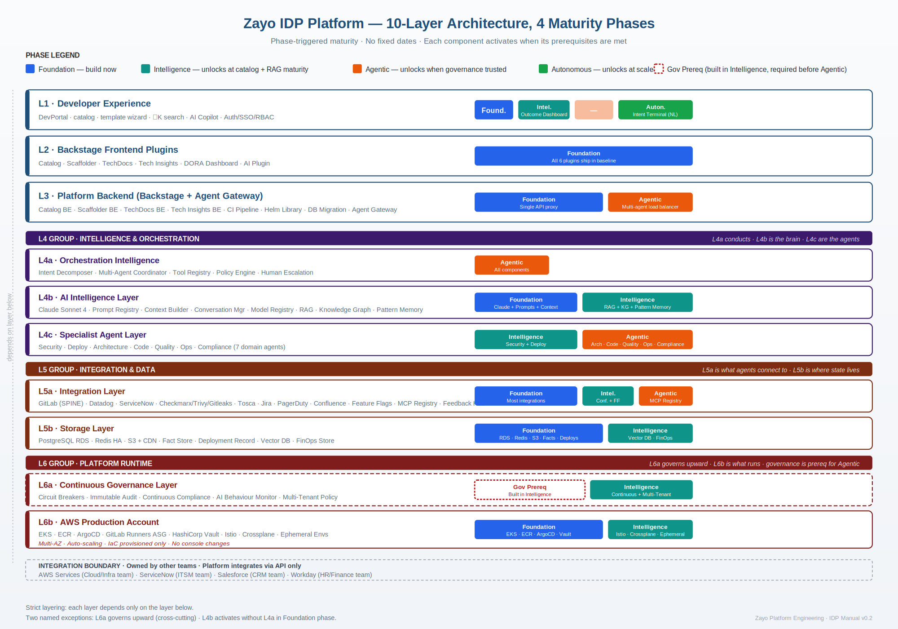
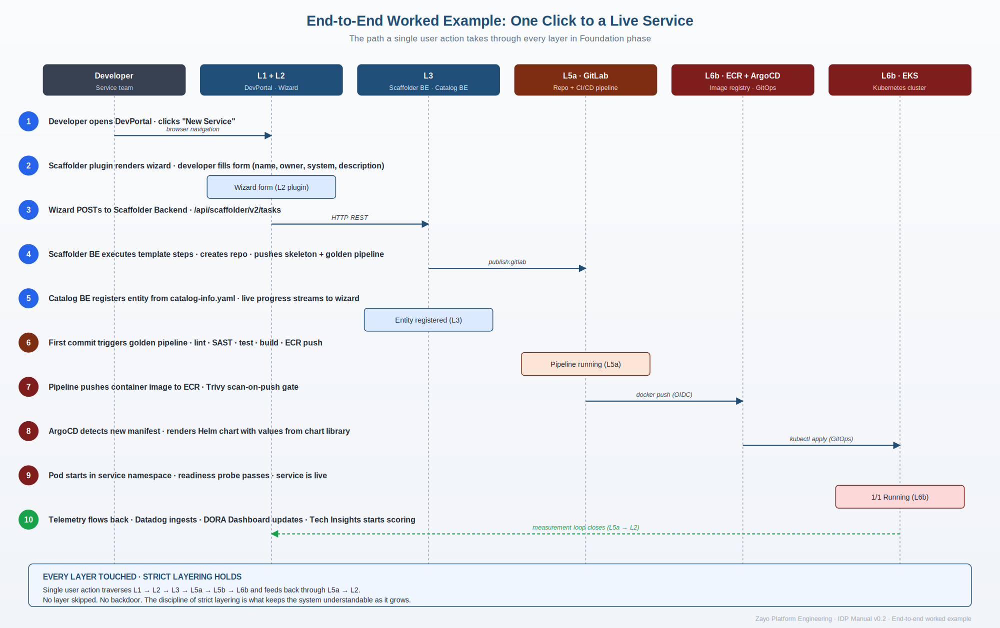

# Internal Developer Platform (IDP)

> A Backstage-based developer portal that provides engineering teams with a self-service, golden-path experience for building, shipping, and operating services.

**Status:** Proof of Concept (POC) — wrapping up, transitioning to MVP

---

## Table of Contents

1. [What is the IDP?](#what-is-the-idp)
2. [Why build it?](#why-build-it)
3. [Architecture overview](#architecture-overview)
4. [Architecture diagrams & docs](#architecture-diagrams--docs)
5. [Tech stack](#tech-stack)
6. [Repository layout](#repository-layout)
7. [Prerequisites](#prerequisites)
8. [Local development setup](#local-development-setup)
9. [Running Backstage](#running-backstage)
10. [Configuration](#configuration)
11. [AWS accounts and access](#aws-accounts-and-access)
12. [GitLab CI/CD integration](#gitlab-cicd-integration)
13. [Backstage features in this POC](#backstage-features-in-this-poc)
14. [Scaffolder templates (golden paths)](#scaffolder-templates-golden-paths)
15. [Software catalog](#software-catalog)
16. [TechDocs](#techdocs)
17. [Search](#search)
18. [Common troubleshooting](#common-troubleshooting)
19. [Known issues](#known-issues)
20. [Roadmap](#roadmap)
21. [Contributing](#contributing)

---

## What is the IDP?

The Internal Developer Platform is a self-service portal that lets developers create, run, and manage services through a paved path. It removes the toil of stitching together GitLab, AWS, Kubernetes, CI/CD, documentation, and observability for every new service, and replaces it with a single template-driven flow.

The portal is built on [Backstage](https://backstage.io), the open-source developer portal framework originally created at Spotify.

## Why build it?

- **Faster delivery** — service creation moves from multi-day manual setup to minutes via golden-path templates.
- **Standardization** — every service follows the same baseline (pipeline, security scans, docs, ownership, naming).
- **Reduced cognitive load** — developers focus on business logic; the platform handles infra plumbing.
- **Centralized visibility** — the software catalog becomes the single source of truth for what exists and who owns it.
- **Governance & security by default** — image scanning, OIDC auth, code review gates, and SDLC standards baked in.
- **Lower platform-team toil** — self-service flows replace tickets; platform engineers improve the platform instead of doing repetitive setup.
- **Docs-as-code that stays current** — TechDocs live next to the code and publish automatically.
- **Foundation for AI workflows** — MCP/AI actions integration enables AI-assisted developer experiences.

---

## Architecture overview

```
                          ┌─────────────────────────────────┐
                          │       Developer (Browser)       │
                          └────────────────┬────────────────┘
                                           │  https
                                           ▼
                          ┌─────────────────────────────────┐
                          │   Backstage Frontend (React)    │  :3000
                          └────────────────┬────────────────┘
                                           │
                                           ▼
                          ┌─────────────────────────────────┐
                          │  Backstage Backend (Node.js)    │  :7007
                          │  Plugins: catalog, scaffolder,  │
                          │  techdocs, search, kubernetes,  │
                          │  notifications, signals,        │
                          │  mcp-actions, proxy, auth,      │
                          │  permission                     │
                          └──┬────┬────┬────┬─────┬─────────┘
                             │    │    │    │     │
              ┌──────────────┘    │    │    │     └──────────────┐
              ▼                   ▼    ▼    ▼                    ▼
      ┌──────────────┐   ┌──────────────┐  ┌──────────────┐  ┌──────────────┐
      │   GitLab     │   │  AWS (ECR,   │  │  SQLite      │  │  TechDocs    │
      │  (SCM + CI)  │   │  EKS, IAM)   │  │  (local dev) │  │   Local      │
      └──────────────┘   └──────────────┘  └──────────────┘  └──────────────┘
```

**Flow at a glance:**
1. Developer opens the portal and picks a golden-path template.
2. Scaffolder creates a GitLab repo, pushes a skeleton with `catalog-info.yaml`, `mkdocs.yml`, Dockerfile, and `.gitlab-ci.yml`.
3. GitLab CI builds, tests, scans, and pushes a container image to AWS ECR (auth via OIDC).
4. The service auto-registers in the Backstage software catalog and ships with browsable TechDocs.

---

## Architecture diagrams & docs

### Layered architecture



### End-to-end flow



### Full architecture document

The complete architecture write-up is available as a Word document: [IDP Platform Architecture (.docx)](Idp_IDP_Platform_architecture.docx). GitHub renders a preview of `.docx` files when opened in the repo browser; click **Download** there to get a local copy.

---

## Tech stack

| Layer | Tools |
|---|---|
| **Portal** | Backstage OSS, React |
| **Scaffolding** | Backstage Scaffolder, `catalog-info.yaml` |
| **SCM** | GitLab |
| **CI/CD** | GitLab CI/CD, ArgoCD, multi-stage golden pipeline |
| **Container registry** | AWS ECR |
| **Compute** | AWS EKS (target); local dev runs Backstage on macOS |
| **IaC** | Terraform |
| **Auth (CI → AWS)** | AWS SSO / OIDC (no long-lived keys) |
| **Policy & security** | Kyverno, cert-manager, Vault HA, SailPoint IGA |
| **Observability** | Prometheus, Datadog (under evaluation) |
| **AI/ML (roadmap)** | LangGraph, Hugging Face, FAISS, Kubeflow, MLflow, RAG, pgvector |
| **Service integrations** | ServiceNow, Salesforce DX, MS Teams |
| **Local dev DB** | SQLite |
| **Languages** | Node.js, Python (FastAPI), Java, .NET (planned templates) |

---

## Repository layout

```
backstage/
├── app-config.yaml              # Main Backstage configuration
├── app-config.local.yaml        # Local overrides (gitignored)
├── app-config.production.yaml   # Production overrides
├── catalog-info.yaml            # The platform's own catalog entry
├── packages/
│   ├── app/                     # React frontend
│   └── backend/                 # Node.js backend
├── plugins/                     # Custom plugins (if any)
├── examples/                    # Example entities and templates
└── package.json
```

---

## Prerequisites

| Requirement | Version | Notes |
|---|---|---|
| Node.js | **v22.x** | Backstage's current LTS target |
| Yarn | v1.22+ (Classic) or v3+ | `npm i -g yarn` |
| Docker | latest | For TechDocs `docker` generator, container builds |
| Python | 3.9+ | If using local TechDocs builder (`mkdocs`) |
| AWS CLI | v2.x | Configured with SSO |
| GitLab account | — | With access to the platform group |
| Git | latest | — |

Install the TechDocs local generator (only if `techdocs.generator.runIn: 'local'`):

```bash
pip install mkdocs-techdocs-core
```

---

## Local development setup

### 1. Clone the repository

```bash
git clone <your-repo-url>
cd backstage
```

### 2. Install dependencies

```bash
yarn install
```

### 3. Configure environment variables

> ⚠️ **Never commit secrets.** Use a local `.env` file (gitignored) or export in your shell. All secret values below are placeholders.

```bash
# GitLab integration — create a personal access token in GitLab
export GITLAB_TOKEN=<your-gitlab-personal-access-token>

# Backend service-to-service auth secret
# Generate with: openssl rand -base64 32
export BACKEND_SECRET=<generated-secret>

# AWS profile (configured via `aws configure sso`)
export AWS_PROFILE=<your-aws-profile-name>
```

Add `.env` to `.gitignore` if you use one.

### 4. Refresh AWS SSO

SSO tokens expire frequently. Refresh before working:

```bash
aws sso login --profile <your-aws-profile-name>
aws sts get-caller-identity   # verify
```

---

## Running Backstage

### Free the ports first

Backstage uses **3000** (frontend) and **7007** (backend). Clear them if anything is holding them open:

```bash
lsof -ti :3000 | xargs kill -9 2>/dev/null
lsof -ti :7007 | xargs kill -9 2>/dev/null
pkill -f 'port-forward.*backstage' 2>/dev/null
```

### Start the app

```bash
yarn dev
# or, equivalently:
yarn start
```

Wait for the backend log line:

```
Plugin initialization complete
Listening on :7007
```

Then open **http://localhost:3000** in the browser.

### Useful scripts

```bash
yarn start                # start frontend + backend together (dev mode)
yarn start-backend        # backend only
yarn build:backend        # production build of backend
yarn build:all            # production build of everything
yarn test                 # run tests
yarn lint:all             # lint
yarn tsc                  # type-check
```

---

## Configuration

Main config lives in **`app-config.yaml`**. Key sections to know.

> ⚠️ **All values shown as `${VAR}` or `<placeholder>` are read from environment variables — never hard-code secrets in `app-config.yaml`.**

### Backend

```yaml
backend:
  baseUrl: http://localhost:7007
  listen:
    port: 7007
  database:
    client: better-sqlite3
    connection: ':memory:'    # POC; switch to PG for prod
  auth:
    keys:
      - secret: ${BACKEND_SECRET}   # required for search → catalog auth
```

### GitLab integration

```yaml
integrations:
  gitlab:
    - host: gitlab.com
      token: ${GITLAB_TOKEN}
```

### Catalog

```yaml
catalog:
  rules:
    - allow: [Component, System, API, Resource, Location, Template, Group, User]
  locations:
    # IMPORTANT: use /-/blob/ not /-/raw/
    - type: url
      target: https://gitlab.com/<group>/<repo>/-/blob/main/catalog-info.yaml
```

### TechDocs

```yaml
techdocs:
  builder: 'local'         # POC: build on the fly
  generator:
    runIn: 'local'         # 'docker' if you prefer containerized mkdocs
  publisher:
    type: 'local'
```

### Auth (POC uses guest)

```yaml
auth:
  providers:
    guest: {}
```

---

## AWS accounts and access

The IDP uses AWS SSO with two roles for separation of duties:

| Profile (example) | Permission set | Use |
|---|---|---|
| `dev-profile` | **PowerUser** | Day-to-day POC resources (ECR, dev workloads). Cannot manage IAM. |
| `admin-profile` | **Administrator** | IAM-management tasks (OIDC providers, roles, IAM users). |

> Profile names, account IDs, and account aliases are environment-specific and not committed to this repo.

### Switching profiles

```bash
export AWS_PROFILE=<dev-profile>     # day-to-day POC
export AWS_PROFILE=<admin-profile>   # IAM / OIDC setup
```

Suggested shell aliases (add to `~/.zshrc`):

```bash
alias awsdev='export AWS_PROFILE=<dev-profile>; aws sts get-caller-identity'
alias awsadmin='export AWS_PROFILE=<admin-profile>; aws sts get-caller-identity'
```

### Token expiry

SSO tokens expire after the configured session duration. When you see `Token has expired and refresh failed`:

```bash
aws sso login --profile <profile-name>
```

---

## GitLab CI/CD integration

The IDP standardizes a **golden pipeline** that every scaffolded service inherits via the `.gitlab-ci.yml` shipped from the template.

**Pipeline stages (representative):**

1. `install` — dependency install
2. `lint` — static analysis
3. `test` — unit tests
4. `build` — application build
5. `package` — Docker image build
6. `scan` — image and dependency scans
7. `publish` — push to AWS ECR
8. `deploy` — ArgoCD-driven deploy (where applicable)

### AWS authentication: OIDC, not long-lived keys

CI authenticates to AWS via **OIDC**, exchanging a GitLab job token for short-lived AWS credentials. No `AWS_ACCESS_KEY_ID` / `AWS_SECRET_ACCESS_KEY` is stored in GitLab.

Required setup (in an IAM-capable account):

- IAM OIDC identity provider for `gitlab.com`
- IAM role with a trust policy allowing the GitLab OIDC provider
- Role permissions scoped to ECR push/pull on the relevant repositories

Job snippet (placeholder values — replace `<...>` for your environment):

```yaml
publish-image:
  id_tokens:
    GITLAB_OIDC_TOKEN:
      aud: https://gitlab.com
  variables:
    AWS_REGION: <your-region>
    ECR_REGISTRY: <account-id>.dkr.ecr.<region>.amazonaws.com
    ECR_REPO: <namespace>/<service>
  script:
    - >
      eval $(aws sts assume-role-with-web-identity
      --role-arn "$AWS_ROLE_ARN"
      --role-session-name "gitlab-ci-$CI_PIPELINE_ID"
      --web-identity-token "$GITLAB_OIDC_TOKEN"
      --query 'Credentials.[AccessKeyId,SecretAccessKey,SessionToken]'
      --output text
      | awk '{print "export AWS_ACCESS_KEY_ID="$1"; export AWS_SECRET_ACCESS_KEY="$2"; export AWS_SESSION_TOKEN="$3}')
    - aws ecr get-login-password --region "$AWS_REGION" | docker login --username AWS --password-stdin "$ECR_REGISTRY"
    - docker push "$ECR_REGISTRY/$ECR_REPO:$CI_COMMIT_SHA"
```

> Store `AWS_ROLE_ARN` as a **masked + protected** CI/CD variable in GitLab, not in the repo.

---

## Backstage features in this POC

| Plugin | Status | Notes |
|---|---|---|
| **Catalog** | ✅ Active | Service registry; uses `/-/blob/` URLs for GitLab locations. |
| **Scaffolder** | ✅ Active | Golden-path templates; GitLab + GitHub actions enabled. |
| **TechDocs** | ✅ Local mode | Docs-as-code from `mkdocs.yml` + `/docs`. |
| **Search** | ⚠️ Needs auth fix | 401s on indexing without `backend.auth.keys`. |
| **Kubernetes** | ⚠️ Not wired | `valid kubernetes config is missing` — pending cluster wiring. |
| **Notifications** | ✅ Loaded | Available for scaffolder + pipeline events. |
| **Signals** | ✅ Loaded | Real-time events backbone. |
| **MCP Actions** | ✅ Loaded | AI/agent action integration. |
| **Proxy** | ✅ Active | Generic proxy for backend APIs. |
| **Auth** | ✅ Guest (POC) | Production needs an OIDC/SSO provider. |
| **Permissions** | ❌ Disabled (POC) | Enable post-POC with a baseline policy. |

---

## Scaffolder templates (golden paths)

### Available

- **Node.js service** (in progress) — repo + Dockerfile + `.gitlab-ci.yml` + `catalog-info.yaml` + TechDocs scaffold + ECR pipeline.

### Planned

- **Java** service template
- **.NET** service template
- **Python (FastAPI)** template

A template lives under `examples/template/` (or a dedicated templates repo) and is referenced by a `Location` entity in the catalog.

---

## Software catalog

Every service registers itself by committing a `catalog-info.yaml` to its repo root. Example (placeholders):

```yaml
apiVersion: backstage.io/v1alpha1
kind: Component
metadata:
  name: <service-name>
  description: <service description>
  annotations:
    gitlab.com/project-slug: <group>/<subgroup>/<repo>
    backstage.io/techdocs-ref: dir:.
spec:
  type: service
  lifecycle: experimental
  owner: <team-or-group>
  system: <system-name>
```

> **Important:** when registering locations in `app-config.yaml` or via the portal UI, use the **`/-/blob/`** GitLab path, **not** `/-/raw/`. Backstage normalizes blob URLs to raw internally.

---

## TechDocs

Every scaffolded service ships with:

```
service-repo/
├── mkdocs.yml
├── docs/
│   ├── index.md
│   ├── getting-started.md
│   └── api.md
└── catalog-info.yaml   # with backstage.io/techdocs-ref: dir:.
```

Sample `mkdocs.yml`:

```yaml
site_name: my-service
nav:
  - Home: index.md
  - Getting Started: getting-started.md
  - API: api.md
plugins:
  - techdocs-core
```

Docs render automatically in the **Docs** tab of the service's catalog entity page.

---

## Search

Backstage Search indexes the catalog and TechDocs every 10 minutes.

> **Important:** the indexer makes service-to-service calls to the catalog/techdocs APIs and requires `backend.auth.keys` to be configured (otherwise both index tasks fail with `401 Unauthorized`). See [Known issues](#known-issues).

---

## Common troubleshooting

### `EADDRINUSE: address already in use ::1:3000`

Something else is bound to port 3000 or 7007 (often a stale `yarn dev` process):

```bash
lsof -ti :3000 | xargs kill -9 2>/dev/null
lsof -ti :7007 | xargs kill -9 2>/dev/null
pkill -f 'port-forward.*backstage' 2>/dev/null
```

### `Token has expired and refresh failed`

AWS SSO token expired:

```bash
aws sso login --profile <profile-name>
```

If SSO login itself fails:

```bash
rm -rf ~/.aws/sso/cache ~/.aws/cli/cache
aws sso login --profile <profile-name>
```

### `Failed extracting project path from … Url path must include /blob/`

A catalog location is using `/-/raw/`. Change it to `/-/blob/` in `app-config.yaml` (or wherever it's registered).

### `Collating documents … Request failed with 401 Unauthorized`

Search can't authenticate to the catalog API. Add `backend.auth.keys` to `app-config.yaml`:

```yaml
backend:
  auth:
    keys:
      - secret: ${BACKEND_SECRET}
```

Generate the secret: `openssl rand -base64 32`.

### `Failed to initialize kubernetes backend: valid kubernetes config is missing`

The Kubernetes plugin is loaded but not configured. Either point it at a cluster or remove the plugin from `app-config.yaml` until needed.

---

## Known issues

- **Catalog registration URLs** — any `catalog-info.yaml` locations registered with `/-/raw/` must be updated to `/-/blob/`.
- **Search 401 Unauthorized** — backend auth keys not configured; both `search_index_software_catalog` and `search_index_techdocs` tasks fail until fixed.
- **Permissions framework disabled** — fine for POC, must be enabled with a baseline policy before production.
- **Kubernetes plugin** — initializes with no valid kube config; needs cluster wiring or removal from config.

---

## Roadmap

### POC wrap-up (current)
- Catalog URL fix, search 401 fix, TechDocs in golden path
- Architecture diagram, onboarding manual, POC findings
- Node.js scaffolding + end-to-end ECR pipeline via OIDC
- Dev portal React front-end flow fixes
- Architect/advisory governance for SaaS platform SDLCs (Salesforce, ServiceNow)

### MVP (next)
- Onboard a real application team end-to-end as the MVP deliverable
- Permissions/RBAC enabled with baseline policy
- Production-grade backend (Postgres, S3 TechDocs publisher, real auth)

### Forward-looking
- Multi-language scaffolding templates (Java, Node, .NET, Python)
- Formal observability stack evaluation (Prometheus vs. Datadog)
- ServiceNow change-request automation
- AI Copilot integration
- Autonomous agent workflows

---

## Security note

This README intentionally contains **no** account IDs, profile names, secrets, tokens, internal hostnames, or organization-specific identifiers. Replace all `<placeholder>` values with your own environment-specific details — and store secrets in environment variables or a secrets manager, never in the repo.

If you fork this and add environment-specific config, double-check before pushing:

```bash
# quick scan for common secret patterns
grep -rE "(AKIA[0-9A-Z]{16}|aws_secret_access_key|password|token|secret)" . \
  --exclude-dir=node_modules --exclude-dir=.git
```

---

## Contributing

1. Branch from `main`: `git checkout -b feature/<short-description>`.
2. Run lint, type-check, and tests locally before pushing.
3. Open a merge request and tag a reviewer.
4. Update TechDocs (`/docs`) in the same MR if you change behavior.

---

## License

Specify your license here (e.g., MIT, Apache-2.0).

---

*This README describes a Backstage-based IDP POC. Some sections describe planned or in-progress work — see the Roadmap and Known issues sections for current state.*
